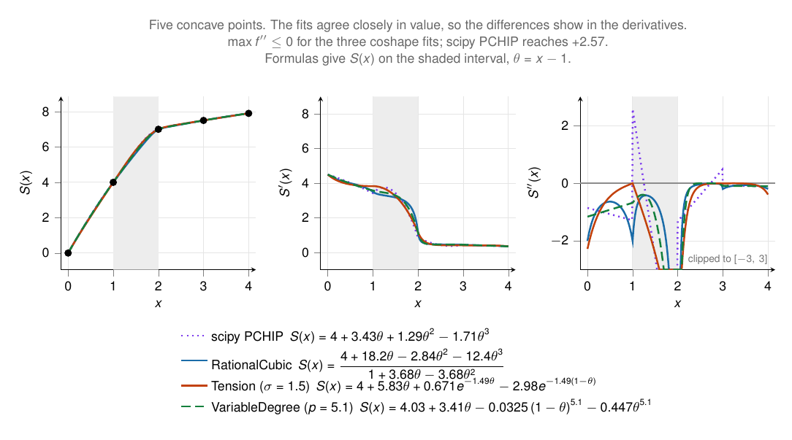

# coshape

[](https://github.com/Feiyang472/coshape/actions/workflows/ci.yml)

A Rust implementation of some published shape-preserving 1-D spline
interpolation methods, behind a small `linfa`-style API. Named for **co**-convex
/ **co**-monotone interpolation: the fit follows the data's own shape instead of
introducing oscillations of its own.

Given concave data, the fitted interpolant passes through the knots exactly,
keeps `f'' <= 0` everywhere, and is at least C². Convex data gives the mirror
image, and the tension and variable-degree methods also follow data that changes
curvature, concave in one stretch and convex in the next.



The three methods fitted to five concave points, alongside scipy's
`PchipInterpolator`. The fits agree closely in value, so the differences show in
the derivatives: all three hold `f'' <= 0` across the whole range, while PCHIP —
which preserves monotonicity rather than curvature, and is only C¹ — reaches
`f'' = +2.57`. Each legend entry gives the closed form that method produces on
the shaded interval, in the local coordinate `θ = x − 1`.

## Usage

A *parameter* struct implements `Fit`; `fit` returns a model implementing
`Interpolator1d`:

```rust
use coshape::{Fit, Interpolator1d, RationalCubic};

let x = [0.0, 1.0, 2.0, 3.0, 4.0];
let y = [0.0, 3.0, 5.0, 6.2, 6.8]; // concave, increasing — diminishing returns

let spline = RationalCubic::new().fit(&x, &y)?;
let value  = spline.value(2.5);
let curv   = spline.second_derivative(2.5); // <= 0
```

## Methods

Each is an implementation of a method from the literature; the papers are the
authoritative description, and the citations below are where to look for the
details.

- **`RationalCubic`** — curvature-preserving C² rational cubic spline: concave
  data in, concave interpolant out, and likewise for convex data. Cubic numerator
  over a quadratic denominator with three shape parameters per interval; the
  curvature condition is closed-form per interval (their Theorem 4). Since the
  convexity parameter `w` couples into the C² system, the fit runs a small
  under-relaxed fixed point (solve the C² tridiagonal ↔ update `w`), which is
  exactly C² at every iterate and shape-correct at convergence. The paper states
  its bound for the convex orientation, so concave data is fitted through its
  exact reflection `y ↦ −y` and reflected back. Data with an inflection is
  rejected — use one of the other two methods for that.

  M. Abbas, A. A. Majid, J. M. Ali, convexity-preserving rational cubic spline
  interpolation, 2014.

- **`Tension`** — exponential/hyperbolic tension spline, following the `HVAL` /
  `YPC2` / `SIGS` / `SNHCSH` routines. Shape-preserving by default: each
  interval's tension factor is chosen automatically (`SIGS`) as the smallest
  value preserving the data's local curvature sign and monotonicity, iterated against
  the C² slope solve as `TSPSI` does. A fixed uniform tension factor (`σ = 0`
  cubic → `σ → ∞` piecewise-linear) is available via `with_uniform_tension`.

  R. J. Renka, *Algorithm 716: TSPACK — Tension Spline Curve-Fitting Package*,
  ACM Trans. Math. Softw. **19**(1):81–94, 1993.

- **`VariableDegree`** — co-convex C² variable-degree polynomial spline, the
  polynomial counterpart of `Tension`: it raises a per-interval **degree**
  instead of a tension. Written through the knot moments `Mᵢ = f''(xᵢ)` as
  `f'' = Mᵢ(1−t)^{pᵢ−2} + Mᵢ₊₁ tᵖⁱ⁻²`, so the interpolant follows the data's
  curvature exactly when the moments carry its sign (`≤ 0` on concave stretches),
  and the moment system reduces to the classical cubic spline at degree 3. Unlike
  `RationalCubic` it accepts data with inflections, and does not reject collinear
  data (there the degree drives the piece to a line).

  In the family of P. D. Kaklis, M. I. Pandelis, *Convexity-preserving
  polynomial splines of non-uniform degree*, IMA J. Numer. Anal.
  **10**(2):223–234, 1990, and P. Costantini's variable-degree splines.

## Architecture

`samples` (validation + secants), `tridiagonal` (Thomas solver), and `piecewise`
(interval lookup + evaluation dispatch) are method-agnostic; each method
supplies only its per-interval piece and its parameter-selection solver.

## Validation

`Tension` is cross-validated against Renka's original TSPACK Fortran in
`tests/tspack_crossvalidation.rs`, checking value and first/second derivative on
a dense grid against committed fixtures:

- **uniform tension** — driven by TSPACK's `YPC2`; agreement ~1e-11 relative.
- **shape-preserving** — driven by TSPACK's `TSPSI` (the full `SIGS` + slope
  iteration); the selected per-interval tensions, iteration count, and evaluated
  curve reproduce the Fortran to roundoff (~1e-12).

Regenerate the fixtures with `python3 tools/tspack/gen_reference.py`; see
`tools/tspack/README.md`.

## Development

```sh
cargo test
cargo clippy --all-targets -- -D warnings
cargo fmt --all --check
```

## License and attribution

Dual-licensed under MIT OR Apache-2.0 — see [`LICENSE-MIT`](LICENSE-MIT) and
[`LICENSE-APACHE`](LICENSE-APACHE); pick either.

No third-party source code is included in or redistributed by this crate. The
methods are written in Rust from the published algorithm descriptions cited
above; the credit for them belongs to their authors.

This matters in particular for TSPACK, whose source is distributed under the ACM
Software License Agreement, which restricts redistribution: no TSPACK or ACM
source is vendored here. The fixtures in `tests/data/*.json` are numerical
outputs (values, derivatives, selected tensions) produced by running TSPACK
locally — validation data, not ACM source. Regenerating them downloads TSPACK
from netlib and compiles it into a git-ignored directory for local validation
only.

Unless you state otherwise, any contribution you intentionally submit for
inclusion in this crate shall be dual-licensed as above, without additional
terms.
